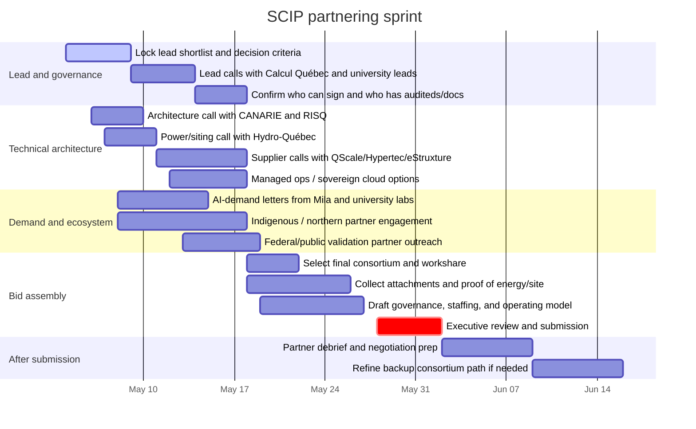

> **PUBLICATION BLOCKER:** This file contains non-portable assistant/UI citation artifacts. Keep it internal until the underlying sources are reconstructed and cited in a portable format.

# Canadian Institutional Partner Inventory for the AI Sovereign Compute Infrastructure Program

## Executive summary

The federal AI Sovereign Compute Infrastructure Program is unusually demanding for a lead applicant. Only Canadian not-for-profits, Canadian post-secondary institutions, or consortia led by one of those entities can apply. The lead must be able to sign the contribution agreement, carry the financial and operating accountability, and provide proof of legal status, three years of financial statements, a detailed staffing plan, evidence of a similar operational system, proof of energy supply, technical design documents, and site-control information. The program also explicitly rewards speed to delivery, future scalability, Canadian governance and data sovereignty, economic impact, and meaningful Indigenous engagement. citeturn1view0turn2view8turn2view3turn2view4turn2view6turn2view1

That combination of requirements sharply narrows the field. In practice, the strongest lead candidates are existing public universities or national/provincial non-profits that already run advanced research computing, data-centre operations, or national research infrastructure. Utilities, telecoms, modular data-centre firms, and sovereign-cloud vendors are often essential consortium partners, but they are generally much stronger as key partners than as SCIP leads because the program’s lead-eligibility rule points toward non-profit or post-secondary governance. citeturn1view0turn2view8turn4search0turn7search10turn7search0

For a Quebec-based proponent, the strongest near-term coalition is a **Quebec-led public consortium** built around **Calcul Québec plus one statutory university lead**—most plausibly **McGill**, **Université de Montréal**, or **Université Laval**—with **CANARIE** and **RISQ** for backbone networking and interoperability, **Hydro-Québec** for power/tariff/site-readiness discussions, **Mila** and possibly **IVADO** for AI demand and scientific legitimacy, and one or more Canadian infrastructure suppliers such as **QScale**, **Hypertec**, **eStruxture**, **ThinkOn**, or **TELUS** for capacity, sovereign operations, cooling, and deployment speed. That coalition is the best fit to the program’s scoring pressures: credible lead eligibility, documented operating experience, Quebec AI demand concentration, power access, and rapid deployability. citeturn7search10turn19search8turn20search7turn16search3turn3search2turn11search0turn29search0turn17search2turn27search0turn34search0turn35search0turn37search1turn38search2turn32search1

My highest-confidence conclusion is that you should **not** begin by shopping for a generic “support letter.” You should begin by securing a **credible lead-capable operator** with audited finances and comparable system operations, then rapidly add the power, network, Indigenous-engagement, and supplier layers around that lead. In Quebec, that means your first calls should go to **Calcul Québec**, **McGill**, **Université de Montréal**, **Université Laval**, **CANARIE**, **RISQ**, and **Hydro-Québec**—in that order or in two parallel tracks. citeturn2view8turn2view4turn2view3turn7search10turn19search8turn20search7turn16search3turn3search2turn11search0turn29search0

### Scoring framework used in this report

I ranked candidates on a 100-point analytic scale weighted to SCIP’s build-layer realities: **lead eligibility and governance readiness (25)**, **existing HPC or AI operations (20)**, **site/power/network readiness (20)**, **national interoperability and ecosystem fit (15)**, **Quebec and Indigenous/Northern fit (10)**, and **partnership speed and delivery leverage (10)**. The scores are my synthesis of the official sources below; they are not a government assessment. The weighting mirrors SCIP’s own emphasis on capacity, speed, scalability, sovereignty, economic impact, and Indigenous considerations. citeturn1view0turn2view1turn2view2

### Simple view of the top-tier pool

```text
Lead-capable post-secondary / nonprofit operators   ██████████████ 14
Research and education networks / DRI platforms      ████████ 8
Utilities / telecom / sovereign infra suppliers      ███████ 7
Indigenous / northern / public-sector partners       █████ 5
```

## What SCIP rewards and how that should shape partner selection

The program is expressly for the **Infrastructure Build Layer**, not the service layer. That means the winning team must credibly demonstrate hardware deployment, data-centre operations, systems administration, a secure and Canadian-governed operating model, and the ability to move quickly. A partner that is academically prestigious but cannot show site control, operating staff, energy supply, or prior comparable infrastructure is materially weaker than a less famous institution that already runs major ARC or cloud systems. citeturn1view0turn2view8turn2view3turn2view6

The program guide also makes consortium architecture important. Partners can include universities, research organizations, civil society, industry, and other governments, but one eligible lead must carry the application. Organizations may act as lead for only one application while still joining others as consortium members. This creates a real scarcity problem: if one of the strongest university or non-profit leads decides to back another consortium, it may become unavailable as your lead even if it remains available as a partner. citeturn2view8turn2view5

Indigenous participation should not be treated as a late-stage checkbox. SCIP requires applicants to demonstrate meaningful engagement where impacts or opportunities exist, including strategies to mitigate impacts on Indigenous lands and resources and, where appropriate, to deliver long-term benefits such as employment and training. That means an Indigenous government or Indigenous technology/research partner should be invited into the consortium architecture early enough to shape governance, workforce, community benefits, and site conversations. citeturn2view1

## Ranked top-25 partner list

| Rank | Partner | Type | Lead-eligible? | Score | Why this partner ranks highly | Suggested outreach ask | Evidence |
|---|---|---:|---:|---:|---|---|---|
| 1 | Digital Research Alliance of Canada | National non-profit | Yes | 92 | The Alliance is the closest thing Canada has to a national public compute backbone: it coordinates ARC nationally, funds and integrates infrastructure and services, and sits over a federation of 38 partner universities and 5 regional organizations. Even if it prefers not to lead, it is the strongest convener and design authority for a sovereign public supercomputer bid. | Ask whether it intends to lead, sponsor, or remain neutral; if neutral, ask what a Quebec-led consortium must prove to be viewed as interoperable with the national stack. | citeturn4search0turn4search5turn3search8 |
| 2 | Calcul Québec | Regional non-profit HPC operator | Yes | 90 | Calcul Québec is a Quebec non-profit whose core mission is world-class HPC infrastructure, support, and training for Quebec and Canadian researchers. It already operates major systems and is a regional Alliance partner, which makes it the most natural Quebec-native institutional engine for a SCIP build bid. | Ask whether it would lead directly or serve as technical co-lead under a university lead; request an immediate discussion on host-site options, audited-financial readiness, staffing, and reference projects. | citeturn7search10turn20search1 |
| 3 | McGill University | Public university | Yes | 88 | McGill is a national host site in the Alliance ecosystem and is tied directly to the Béluga and Narval systems operated by Calcul Québec; it also has an institutional digital research services support layer. As a statutory university, it solves lead-eligibility and governance problems while bringing host-site credibility and Montreal AI proximity. | Ask the VPRI and digital research services team whether McGill would consider being statutory lead while Calcul Québec provides operating design and execution. | citeturn19search8turn16search0 |
| 4 | Université de Montréal | Public university | Yes | 87 | Université de Montréal anchors the Quebec AI ecosystem through Mila and IVADO and has publicly linked itself to the rollout of the Rorqual supercomputer with Calcul Québec. It is probably the single strongest scientific-demand anchor in Quebec if the proposal aims to foreground AI research intensity and ecosystem concentration. | Ask whether UdeM would anchor demand, governance, and scientific access while Calcul Québec and a host-site team supply operating depth. | citeturn20search7turn17search2turn27search0 |
| 5 | Université Laval | Public university | Yes | 86 | Université Laval is a named PAICE infrastructure partner and host-side technical contributor in Canada’s dedicated AI compute environment, which gives it unusually relevant AI-specific operating credibility. It is also a strong Quebec alternative if Montreal alignment becomes politically or institutionally crowded. | Ask whether Laval wants to be principal lead or Quebec co-lead, and request a discussion on PAICE lessons learned, technical staffing, and Quebec City site-readiness conditions. | citeturn16search3turn27search0turn19search9 |
| 6 | CANARIE | National non-profit network operator | Yes | 85 | CANARIE is a non-profit corporation and operates the national research and education network that ties the provincial and territorial networks together. No serious SCIP bid should proceed without an explicit CANARIE conversation because national backbone, interoperability, and resilience are central to sovereign compute operations. | Ask for a network architecture session covering interprovincial backbone, 100G/400G pathways, failover, security, and integration with provincial REN partners. | citeturn3search2turn3search6turn11search5 |
| 7 | University of Waterloo | Public university | Yes | 84 | Waterloo’s new Nibi system replaced Graham and explicitly highlights water-based cooling and heat reuse to heat the Lazaridis Quantum-Nano Centre. That is exactly the kind of “site plus sustainability plus operational experience” SCIP reviewers will notice. | Ask for a lessons-learned call on Nibi procurement, cooling architecture, heat reuse economics, and staffing for refreshed national systems. | citeturn22search4turn22search6turn16search0 |
| 8 | University of Toronto and SciNet | Public university / HPC consortium | Yes | 84 | SciNet is one of Canada’s largest HPC centres and has long operated Niagara and now the Trillium-era stack, including training and sensitive-data adjacent environments. U of T is especially useful if you want an operator with deep experience in national-scale user service, storage, and research-hospital adjacency. | Ask for a technical-operating-model briefing and whether U of T would join a Quebec-led bid as co-operator, reviewer, or backup host pathway. | citeturn24search7turn24search1turn16search0 |
| 9 | Mila | Quebec AI institute | Yes | 83 | Mila is a non-profit and the densest concentration of deep-learning research talent in the country, with strong ties to UdeM, McGill, Polytechnique, Concordia, Laval, Sherbrooke, and ÉTS. It is weaker as a literal infrastructure operator than a university or ARC non-profit, but exceptionally strong as a scientific-demand and policy-visibility partner. | Ask Mila for a demand letter, a scientific-advisory role, and introductions across its affiliated-university network for consortium formation. | citeturn17search2 |
| 10 | Simon Fraser University and Cedar Supercomputing Centre | Public university | Yes | 82 | SFU now brands the Cedar/Fir centre as national sovereign infrastructure, emphasizing clean energy, very low PUE, AI deployment, and support for Canadian companies and institutions. That makes SFU one of the few universities already speaking the same language as SCIP’s sovereignty-and-speed logic. | Ask for a discussion on how SFU structured industry access, sustainability metrics, and the governance transition from one national system generation to the next. | citeturn22search2turn22search1turn22search9 |
| 11 | Université de Sherbrooke | Public university | Yes | 81 | Sherbrooke’s scientific computing centre combines systems administration, HPC analysts, software developers, and AI specialists, and the university has just launched a chair focused on chip integration for high-performance computing. It is one of the best Quebec partners for the “compute plus packaging plus operations talent” story. | Ask Sherbrooke to explore a role around systems engineering, microelectronics, and expert operations staffing rather than purely symbolic academic participation. | citeturn19search1turn19search2 |
| 12 | University of Victoria and Arbutus Cloud | Public university | Yes | 80 | UVic hosts Arbutus, Canada’s largest academic research cloud, and has also publicized water-cooling and heat-reuse upgrades. If your bid needs a cloud-native operating partner or a credible argument for modular growth beyond one monolithic cluster, UVic is extremely valuable. | Ask for an architecture review on cloud/HPC hybridity, storage scaling, and how Arbutus was funded and renewed. | citeturn25search0turn25search1turn25search2 |
| 13 | RISQ | Quebec research and education network | Yes | 79 | RISQ is a Quebec non-profit dedicated to education and research networking, with a private fibre network, redundancy, direct cloud access, and specific positioning as Quebec’s gateway to national HPC infrastructure. For any Quebec-led bid, RISQ is the most practical provincial fibre and interconnect partner. | Ask for a Quebec backbone topology review, dark-fibre or dedicated-path options, and a cost/timeline memo for connecting a shortlisted site to national and cloud routes. | citeturn11search0turn11search2turn11search3turn11search7 |
| 14 | Hydro-Québec | Utility | No | 78 | Hydro-Québec is critical because SCIP requires proof of energy supply, and Hydro-Québec has already moved to establish a dedicated rate approach for large data centres. Quebec’s renewable electricity profile is a major advantage, but it must be converted into a real site, tariff, and interconnection pathway fast. | Ask for a meeting on available capacity, queue position, indicative tariff treatment, interconnection timing, and whether waste-heat reuse can strengthen the file. | citeturn29search0turn29search8turn29search12 |
| 15 | UBC Advanced Research Computing | Public university | Yes | 78 | UBC ARC is actively modernizing its digital research infrastructure and already runs institutional HPC, storage, cybersecurity, and cloud-advice services, including the Sockeye platform. It is not as directly central to the national host-site map as Waterloo, Toronto, or SFU, but it is a serious operating institution with current expansion momentum. | Ask for a peer-learning conversation on staged modernization, institutional-security review, and balancing campus and national compute. | citeturn21search0turn21search2turn21search10 |
| 16 | Compute Ontario | Provincial DRI platform | Likely yes, confirm | 77 | Compute Ontario coordinates provincial DRI investments, funding alignment, and service-provider collaboration, and explicitly ties Ontario’s DRI ecosystem to large providers including U of T and Waterloo. It is more of a governance and planning platform than a host site, but that can be valuable in a cross-provincial consortium. | Ask for Ontario demand data, governance artifacts, and advice on how to structure multi-provider operating arrangements. | citeturn7search1turn7search6turn7search9 |
| 17 | TELUS Sovereign AI Factory | Telecom / sovereign compute operator | No | 76 | TELUS now operates a fully sovereign AI factory in Rimouski with Canadian control, renewable energy, and immediate compute access for public institutions and researchers. It is not lead-eligible under SCIP’s current rule set, but it may be the fastest “operations plus sovereign facility” private partner available in Quebec today. | Ask whether TELUS would provide managed-operations support, overflow capacity, or a sovereign-facility workstream inside a public-led SCIP bid. | citeturn32search1turn32search2turn32search7 |
| 18 | QScale | Quebec AI data-centre developer | No | 75 | QScale’s Lévis campus is built for AI colocation with high-density liquid cooling, waste-heat recovery, a large secured power envelope, and HPE as an anchor tenant. For a Quebec file emphasizing rapid physical deployment and environmental performance, QScale is one of the most useful private-side partners. | Ask for a non-confidential siting discussion: available phases, power commitments, rack density, security posture, and what public-governed tenancy model it could support. | citeturn34search0turn34search5turn34search9 |
| 19 | Hypertec | Canadian HPC / AI hardware supplier | No | 74 | Hypertec brings 25+ years of HPC expertise, AI cloud infrastructure, and immersion/liquid-cooling capabilities; in a separate sovereign-cloud launch it is described as the only NVIDIA OEM headquartered in Canada. It is a strong domestic supplier candidate for Canadian-assembled hardware and dense AI infrastructure, though corporate-control diligence is still needed. | Ask for a rapid-response bill-of-materials conversation, deployment timelines, Canadian assembly content, and modular cooling options for a public supercomputer build. | citeturn35search0turn38search4 |
| 20 | eStruxture | Canadian-owned data-centre platform | No | 73 | eStruxture is the largest Canadian-owned data-centre provider, with a national footprint and an explicit sovereign government-cloud role in its 2025 partnership launch. It is particularly useful if your lead wants a Canadian facilities partner without taking immediate greenfield construction risk. | Ask for Montreal and Quebec-area sovereign colocation options, power availability, and how eStruxture would support a public-governed tenancy model. | citeturn37search0turn37search1turn37search3 |
| 21 | ThinkOn | Canadian-owned sovereign cloud | No | 72 | ThinkOn is wholly Canadian-owned and operated, markets sovereign cloud heavily, and is used in Canadian public-sector contexts. It is better positioned for sovereign control-plane, storage, and managed-cloud layers than for primary supercomputer hosting, but that may still be strategically important. | Ask whether ThinkOn can provide compliant control-plane, archival, backup, or hybrid-cloud components under a public lead. | citeturn38search2turn38search4turn38search6 |
| 22 | National Research Council Canada | Federal R&D organization | No | 71 | NRC’s Digital Technologies Research Centre and Data Analytics Centre bring AI, data science, industrial collaboration, and significant public-sector credibility. NRC is not a SCIP lead candidate under the stated rules, but it could materially strengthen the proposal’s technical-validation, testbed, and economic-impact case. | Ask whether NRC would join as validation/testbed/R&D partner, especially around AI safety, industrial use cases, and domestic technology integration. | citeturn41search0turn41search3turn41search7 |
| 23 | ORION | Ontario research and education network | Likely yes, confirm | 71 | ORION is Ontario’s research and education network, with a large fibre footprint and deep ties to advanced computing centres. It is chiefly valuable as a second-province backbone and governance partner if your consortium needs stronger pan-Canadian optics. | Ask for a conversation on Ontario interconnect, research-network security, and whether ORION would support a national access model linked to a Quebec build. | citeturn13search0turn13search5turn12search2 |
| 24 | BCNET | BC research and education network | Yes | 70 | BCNET is a long-standing BC non-profit that runs a major advanced network and shared services for higher education and research. It is especially useful if your bid wants western network redundancy, cloud-provider adjacency, and a partner experienced in shared governance. | Ask for a short technical session on interconnection, 400G readiness, and shared-service procurement approaches that could transfer to SCIP. | citeturn10search0turn10search1turn10search2 |
| 25 | Nunatsiavut Government and Nunatsiavut Research Centre | Indigenous government / research centre | No | 69 | The Nunatsiavut Government’s research centre in Nain already supports interdisciplinary field and lab work, connectivity, and community-accountable research review. It stands out as a serious Indigenous governance and northern-benefits partner if your proposal wants to make Indigenous participation concrete rather than symbolic. | Ask whether the government would explore an Indigenous benefits and skills pathway, research-governance role, or northern innovation component in a public-compute proposal. | citeturn39search2turn39search8 |

### Immediate partner strategy

The **highest-probability lead shortlist** is: **Calcul Québec**, **McGill**, **Université de Montréal**, **Université Laval**, **the Alliance**, and then the strongest national alternatives outside Quebec—**University of Waterloo**, **University of Toronto**, **Simon Fraser University**, and **University of Victoria**. The most important non-lead partners to bring in very early are **CANARIE**, **RISQ**, **Hydro-Québec**, **Mila**, and one Indigenous or northern governance partner. citeturn7search10turn19search8turn20search7turn16search3turn4search0turn22search4turn24search7turn22search2turn25search0turn3search2turn11search0turn29search0turn17search2turn39search2

If you want one practical recommendation rather than a menu, it is this: **try to structure the file as a Quebec-led public consortium with a university lead and Calcul Québec as the technical-operating backbone**. That structure best answers the program’s legal, financial, staffing, energy, and operations requirements while staying closest to Quebec’s AI demand base. citeturn2view8turn2view4turn2view3turn7search10turn17search2

## Comprehensive inventory of validated partners

The tables below are a **comprehensive working inventory of the strongest candidates I could validate from primary and institutional sources in this pass**. Scores use the same 100-point framework as the top-25.

### Lead-capable research and non-profit anchors

| Partner | Legal status and geography | Public contact | Relevant capabilities and relevant projects | Lead capacity | Key risks / constraints | Score | Evidence |
|---|---|---|---|---|---|---:|---|
| Digital Research Alliance of Canada | Canadian non-profit; national | National office / ARC support | Coordinates and funds ARC, RDM, RS; federation of 38 universities and 5 regional orgs; runs national services | Strong | May avoid choosing a side if multiple bids emerge; may prefer neutrality | 92 | citeturn4search0turn4search5turn3search8 |
| Calcul Québec | Quebec non-profit; Montreal / province-wide | Calcul Québec HQ | Operates Quebec HPC infrastructure and training; Alliance regional partner; supercomputers accessible across Canada | Strong | Must confirm its own appetite to lead versus operate under university umbrella | 90 | citeturn7search10turn20search1 |
| McGill University | Public post-secondary; Montreal | Digital Research Services / drs@mcgill.ca | National host-site ties to Béluga and Narval; institutional digital research support | Strong | May prefer consortium role instead of sole lead; internal competition possible | 88 | citeturn19search8turn16search0 |
| Université de Montréal | Public post-secondary; Montreal | Research leadership / Calcul Québec interface | Major AI-demand anchor via Mila and IVADO; involved in Rorqual rollout with Calcul Québec | Strong | Needs an operating partner for “similar operational system” depth | 87 | citeturn20search7turn17search2turn27search0 |
| Université Laval | Public post-secondary; Quebec City | Research / infrastructure offices | PAICE infrastructure partner; important Quebec AI and DRI partner | Strong | Public lead is plausible; exact site and operating scope need confirmation | 86 | citeturn16search3turn27search0turn19search9 |
| University of Waterloo | Public post-secondary; Waterloo | Research office / Nibi page | Nibi replaced Graham; heat reuse and water-based cooling; national-scale ARC experience | Strong | Outside Quebec; may prefer Ontario-centred strategy | 84 | citeturn22search4turn22search6turn16search0 |
| University of Toronto / SciNet | Public post-secondary; Toronto/Vaughan | SciNet / info@scinet.utoronto.ca | One of Canada’s largest HPC centres; Trillium transition; training and storage depth | Strong | Outside Quebec; lead could trigger Ontario-centric consortium dynamics | 84 | citeturn24search7turn24search1turn16search0 |
| Simon Fraser University | Public post-secondary; Burnaby | Big Data Hub / sfu_bigdata@sfu.ca | Cedar/Fir sovereign supercomputing centre; clean energy; low PUE | Strong | Outside Quebec; may prioritize its own west-coast growth agenda | 82 | citeturn22search2turn22search5turn22search9 |
| Université de Sherbrooke | Public post-secondary; Sherbrooke | SARIC / saric@USherbrooke.ca | Scientific computing centre with admins, analysts, software and AI specialists; new HPC chip-integration chair | Strong | Not a national host site at the same scale as McGill/UWaterloo/UofT | 81 | citeturn19search1turn19search2 |
| University of Victoria | Public post-secondary; Victoria | Research Computing / arcsupport@uvic.ca | Hosts Arbutus, Canada’s largest research cloud; water cooling and heat reuse | Strong | Cloud-heavy profile may need supplement for classic large-cluster story | 80 | citeturn25search0turn25search1turn25search2 |
| UBC | Public post-secondary; Vancouver | ARC / arc.support@ubc.ca | Sockeye, institutional ARC, cybersecurity and modernization work | Strong | Less central than national host sites for public supercomputer narrative | 78 | citeturn21search0turn21search2turn21search10 |
| University of Alberta | Public post-secondary; Edmonton | Research Computing consultation | University research-computing services and strong AI adjacency through Amii; PAICE partner via U of A | Strong | Not directly evidenced here as major national host beyond AI ecosystem role | 69 | citeturn22search3turn25search3turn16search3 |
| Concordia University | Public post-secondary; Montreal | Office of Research / office.of.research@concordia.ca | Local HPC facility (“Speed”), engineering compute, broad research portfolio | Moderate | HPC assets appear more school-level than province-level; weaker comparable-system evidence | 62 | citeturn20search0turn20search2 |
| École de technologie supérieure | Public post-secondary; Montreal | Research / host-site channels | Physical location for Béluga and Narval systems in Montreal | Moderate | Public-facing operating brand is more Calcul Québec/McGill than ÉTS itself | 67 | citeturn16search0 |
| Polytechnique Montréal | Public post-secondary; Montreal | Research office | Core partner through Mila and IVADO; strong engineering depth | Moderate | Less direct evidence here of major standalone compute operations | 66 | citeturn17search2turn27search0 |

### Networks, DRI platforms, and AI ecosystem non-profits

| Partner | Legal status and geography | Public contact | Relevant capabilities and relevant projects | Lead capacity | Key risks / constraints | Score | Evidence |
|---|---|---|---|---|---|---:|---|
| CANARIE | Canadian non-profit; Ottawa / national | CANARIE corporate contact | National research and education network; 13 provincial/territorial partners; cybersecurity and IAM programs | Strong | May be more natural as network co-lead than total project lead | 85 | citeturn3search2turn3search6turn11search5 |
| RISQ | Quebec non-profit; Quebec-wide | RISQ contact page | Private research-and-education telecom network; 7,000+ km footprint; direct HPC/cloud access | Strong | Strong network layer, but weaker as full data-centre operator | 79 | citeturn11search0turn11search2turn11search3 |
| Compute Ontario | Provincial DRI platform; Ontario | Compute Ontario contact page | Provincial DRI planning and alignment; coordinates consortia supporting Trillium and Nibi | Likely, confirm | Legal lead-readiness should be confirmed with incorporation and financial docs | 77 | citeturn7search1turn7search6turn7search9 |
| Mila | Quebec non-profit; Montreal | Institutional contact page | Largest deep-learning research concentration; cross-university AI institute | Good | Not a primary facilities operator at supercomputer scale | 83 | citeturn17search2 |
| ORION | Ontario non-profit; Toronto | ORION corporate contact | 6,000 km research-and-education fibre network; connects advanced computing centres | Likely, confirm | More network than compute; formal lead paperwork should be verified | 71 | citeturn13search0turn13search5turn12search2 |
| BCNET | BC non-profit; Vancouver | info@bc.net | Provincial advanced network, cybersecurity, procurement and shared services for higher ed/research | Yes | Network-heavy rather than supercomputer-heavy | 70 | citeturn10search0turn10search1turn10search2 |
| ACENET | Atlantic non-profit; St. John’s / Atlantic | info@ace-net.ca | Atlantic DRI/HPC support, regional Siku system at Memorial, long-standing training and support | Yes | Smaller regional scale than Quebec/Ontario host ecosystems | 69 | citeturn7search0turn7search7turn7search8 |
| Cybera | Alberta non-profit; Calgary/Edmonton | info@cybera.ca | Alberta REN, cloud, cybersecurity, startup testbeds, public-sector digital infrastructure | Yes | More network/cloud than hyperscale supercomputing operations | 64 | citeturn8search0turn8search8turn8search4 |
| SRNET | Saskatchewan non-profit; Saskatoon | SRNET contact page | Saskatchewan REN, cybersecurity, procurement, membership includes First Nations and municipalities | Yes | Smaller research-compute footprint than eastern/western host clusters | 61 | citeturn14search1turn14search0turn14search4 |
| MRnet | Manitoba non-profit; Winnipeg | info@mrnet.mb.ca | Manitoba REN, cloud connectivity, cybersecurity, professional services | Yes | Research networking strength exceeds HPC-hosting evidence | 60 | citeturn14search3turn14search7 |
| CIFAR | Canadian not-for-profit / charity; Toronto | CIFAR contact | Leads Pan-Canadian AI Strategy; nexus for AI Chairs and institutes | Good | Strong ecosystem legitimacy, weaker direct infrastructure ops | 67 | citeturn18search0turn18search1turn18search22 |
| Amii | Independent non-profit AI institute; Edmonton | Amii contact | One of Canada’s three national AI institutes; commercialization and talent engine; U of A nexus | Good | Similar to Mila: strong demand and ecosystem value, lighter direct facilities role | 68 | citeturn17search1turn25search3 |
| IVADO | Consortium led by UdeM; Quebec | IVADO contact | Cross-sector AI consortium with UdeM, Poly, HEC, Laval, McGill; training, research, transfer | Possible, legal form to confirm | Strong ecosystem role, but incorporation/ability to sign as lead should be checked | 67 | citeturn27search0turn27search6 |
| SHARCNET | Ontario academic consortium administered by Western | info@sharcnet.ca | Consortium of 19 institutions; major ARC expertise and Graham lineage | Possible, confirm | Governance may sit through member institutions; confirm contracting authority | 66 | citeturn26search0turn26search1turn26search4 |
| Prompt | Quebec non-profit RSRI; Montreal | Prompt contact | Funds and networks collaborative digital-tech R&D; strong industry-research bridge | Yes, but weak fit as infra lead | Excellent industrial-convening partner, not a proven supercomputer operator | 59 | citeturn28search0turn28search8 |

### Indigenous, northern, economic-development, and federal public partners

| Partner | Legal status and geography | Public contact | Relevant capabilities and relevant projects | Lead capacity | Key risks / constraints | Score | Evidence |
|---|---|---|---|---|---|---:|---|
| Nunatsiavut Government / Nunatsiavut Research Centre | Inuit self-government / research centre; Nain, Labrador | Communications@nunatsiavut.com | Community-accountable research review, field/lab facilities, logistics, charter, internet, community benefit orientation | No | Not an obvious SCIP lead under current rule set; best as governance/benefits partner | 69 | citeturn39search2turn39search8 |
| Nunavut Research Institute | Division of Nunavut Arctic College; Iqaluit | NRI contact page | Research licensing, logistics support, labs/equipment, partnerships, Inuit Qaujimajatuqangit orientation | Possible via NAC structure, confirm | Best as northern/Indigenous partner rather than primary operator | 65 | citeturn39search3turn39search5 |
| First Nations Technology Council | Indigenous-led non-profit; North Vancouver | info@technologycouncil.ca | Digital skills, connectivity, research on AI and spectrum, data and technology strategy for 204 First Nations in BC | Yes legally, weak as infra lead | Excellent Indigenous digital-governance partner; limited direct supercomputer operations | 64 | citeturn39search0turn39search6 |
| National Research Council Canada | Federal R&D organization; national | NRC contact | AI, data analytics, digital technologies, industrial piloting, public-sector credibility | No | Not eligible as lead under SCIP rule set | 71 | citeturn41search0turn41search7turn41search2 |
| CanNor | Federal regional development agency; North | infonorth-infonord@cannor.gc.ca | Territorial economic development, Indigenous participation, major-project coordination | No | Regional-development role, not compute operations; stronger as enabling agency | 57 | citeturn42search2turn42search6 |
| Investissement Québec | Quebec financing corporation; Quebec | IQ contact page | Financing, project support, market-entry and growth help | Likely not a fit as lead | Strong financing and incentive partner; not compute operator | 55 | citeturn40search5 |
| Québec International | Regional economic-development corporation; Quebec City | info@quebecinternational.ca | Economic development, investment attraction, digital transformation support | Possible legally, weak practically | Useful for sites, labour, permitting ecosystem; weak comparable-system evidence | 54 | citeturn40search0turn40search10 |
| Montréal International | Non-profit regional economic-promotion agency; Montreal | MI contact page | Investment attraction, talent, ecosystem convening, public-private financing | Yes legally, weak practically | Excellent for foreign/vendor attraction and labour, weak as compute lead | 53 | citeturn40search1turn40search4 |

### Utilities, telecoms, data-centre, and Canadian-controlled supply-chain partners

| Partner | Legal status and geography | Public contact | Relevant capabilities and relevant projects | Lead capacity | Key risks / constraints | Score | Evidence |
|---|---|---|---|---|---|---:|---|
| Hydro-Québec | Provincial electric utility; Quebec | Corporate / large-project contact | Renewable electricity, data-centre tariff pathway, very large grid and control systems | No | Essential but not lead-eligible under stated categories | 78 | citeturn29search0turn29search8turn29search12 |
| TELUS | Canadian telecom / sovereign compute; national, Rimouski anchor | TELUS enterprise / media contacts | Sovereign AI factory in Rimouski, 100% Canadian-controlled and operated factory, PureFibre, public-institution use cases | No | Commercial operator; may compete with public model if role not carefully scoped | 76 | citeturn32search1turn32search2turn32search7 |
| QScale | Quebec AI data-centre company; Lévis | info@qscale.com | 142 MW campus, renewable energy, liquid cooling, waste-heat recovery, 600 kW+ cabinets | No | Commercial colocation model must be reconciled with public-governed infrastructure | 75 | citeturn34search0turn34search5 |
| Hypertec | Canadian-headquartered AI/HPC vendor; Montreal/Laval region | Hypertec sales/support | AI/HPC infrastructure, liquid and immersion cooling, large-scale cloud; Canadian-assembled role in sovereign government cloud stack | No | Canadian-control and supply commitments should be contractually nailed down | 74 | citeturn35search0turn38search4 |
| eStruxture | Largest Canadian-owned data-centre provider; Montreal HQ | eStruxture get-in-touch | 760k+ sq ft, 130+ MW, sovereign government-cloud role, national footprint | No | Commercial colocation economics; power availability varies by site | 73 | citeturn37search0turn37search1turn37search3 |
| ThinkOn | Wholly Canadian-owned and operated CSP; Toronto | ThinkOn sovereign-cloud team | Sovereign cloud, public-sector approvals, Canadian control, data protection, nonprofit research cloud partnership | No | Better for cloud/control/storage layers than primary HPC hosting | 72 | citeturn38search2turn38search6turn38search0 |
| BC Hydro | Provincial Crown utility; BC | BC Hydro corporate contact | Clean electricity and explicit 2026 process for AI/data-centre demand | No | Province-specific and outside Quebec; only matters in west-coast siting track | 66 | citeturn29search1turn29search4 |
| Manitoba Hydro | Provincial Crown utility; Manitoba | 1-888-MBHYDRO | Large integrated utility; strong Indigenous reconciliation language and low-cost power reputation | No | Strong utility partner but less directly tied here to data-centre process | 65 | citeturn30search2turn30search8 |
| Newfoundland and Labrador Hydro | Provincial utility; St. John’s / Labrador | hydro@nlh.nl.ca | Predominantly renewable system, Labrador generation and transmission, remote-grid experience | No | Strong northern-power story; site and network readiness need separate diligence | 64 | citeturn29search3turn29search13turn29search2 |
| Hydro One | Publicly traded utility; Ontario | Corporate contact | Ontario’s largest transmission and distribution provider, including far-north communities | No | Commercial/public utility, not eligible lead; best for Ontario siting options | 63 | citeturn31search3 |
| SaskPower | Provincial Crown utility; Saskatchewan | SaskPower contact | Large grid, growth investments, explicit Indigenous partnership activity | No | Useful only in Saskatchewan siting scenario | 62 | citeturn31search4turn31search6turn31search2 |
| Bell Canada | Canadian telecom; national | Bell Business Markets | Largest Canadian communications company, large fibre footprint, business network services | No | Not profiled here with a sovereign-AI/public-compute specific offer like TELUS | 60 | citeturn32search3 |
| CoolIT Systems | Calgary-headquartered liquid-cooling supplier | Corporate contact | Direct liquid cooling for AI/HPC, 300+ data centres worldwide, modular CDUs/manifolds | No | Excellent cooling supplier, but not clearly Canadian-controlled now | 60 | citeturn34search3turn34search6 |

## Recommended consortium shapes

The strongest **Quebec-first structure** is a **university or Alliance-compatible non-profit lead** with **Calcul Québec as technical-operating backbone**, **Mila** as AI-demand anchor, **RISQ + CANARIE** as network backbone, **Hydro-Québec** for energy readiness, one Indigenous or northern partner for governance and benefits design, and a private stack of **QScale / Hypertec / eStruxture / ThinkOn / TELUS** for speed, hardware, sovereign cloud layers, and colocation contingencies. That arrangement best matches SCIP’s requirement for a real lead with legal status, financial statements, staffing, and evidence of a similar operational system while also maximizing speed to deployment. citeturn2view8turn2view4turn2view3turn7search10turn17search2turn11search0turn3search2turn29search0turn39search2turn34search0turn35search0turn37search1turn38search2turn32search1

A second structure is a **national operator-led consortium** with the **Alliance** or a national host university at the centre and Quebec as the political and scientific anchor rather than the sole operating centre. That approach may be easier if the strongest Quebec institutions hesitate to be statutory lead but are happy to join a national file. The tradeoff is that it is less obviously a Quebec-led opportunity and may be harder to shape around your local priorities. citeturn4search0turn4search5turn24search7turn22search2

A third structure is a **facilities-first sovereign partnership** using an eligible public lead with a Canadian-owned or Canadian-controlled facilities and cloud stack underneath it. This is where **QScale**, **eStruxture**, **ThinkOn**, **TELUS**, and **Hypertec** become most useful: not as lead applicants, but as the fastest route to showing site readiness, dense cooling, sovereign colocation, Canadian hardware, and managed operations. citeturn34search5turn37search1turn38search2turn32search1turn35search0

## Recommended six-week outreach timeline

Because the application deadline is **Monday, June 1, 2026 at 1:00 PM Eastern**, the next four weeks are pre-submission and the following two weeks should be used for post-submission reinforcement and negotiation readiness. citeturn1view0turn2view8



### What each week should accomplish

**Week of May 4:** decide what kind of lead you want. The central question is not “who likes the idea,” but “who can carry the legal, financial, staffing, energy, and operating burden.” By the end of this week, you should know whether you are pursuing a **Calcul Québec plus university** path or a **national-operator** path. citeturn2view8turn2view4turn7search10turn4search0

**Week of May 11:** lock the hard infrastructure stack. This is the week to obtain non-confidential statements or working assumptions on power, fibre, candidate sites, deployment timelines, and domestic supplier content from **Hydro-Québec**, **RISQ**, **CANARIE**, and the top supplier cluster. citeturn29search0turn11search2turn3search6turn34search5turn37search1turn35search0

**Week of May 18:** move from ecosystem to workshare. This is when you should turn supporters into named consortium roles—lead, operator, network, energy, Indigenous/governance, hardware/cooling, sovereign cloud/control plane, and scientific-demand partners—and start gathering the exact attachments SCIP demands. citeturn2view8turn2view3turn2view4

**Week of May 25:** finalize and submit. Any partner that still cannot articulate its role, sign off on a letter, or provide essential diligence by this week should move to the “supporter” tier, not the “core consortium” tier. citeturn1view0turn2view8

## Open questions and limitations

This report is intentionally practical and prioritized for **decision-usefulness before June 1**. I validated the strongest candidates from official or institutional sources, but I did **not** separately verify every plausible regional development agency or every Canadian university. In particular, **ACOA**, **CED for Quebec Regions**, **FedDev Ontario**, **PacifiCan**, and **PrairiesCan** were not fully profiled here and should be treated as potential enabling agencies rather than ranked core operators until directly validated.

Several organizations in the inventory—especially **Compute Ontario**, **ORION**, **SHARCNET**, **IVADO**, and some regional economic-development bodies—appear institutionally plausible as non-profit partners, but if any one of them is being considered as actual lead applicant, you should verify three items immediately: **incorporation status**, **ability to sign a federal contribution agreement**, and **availability of audited financial statements for the last three years**. Those are basic SCIP gating items. citeturn2view8turn2view4

For private-side partners, “Canadian-owned,” “Canadian-controlled,” “Canadian-operated,” and “Canadian-headquartered” are **not interchangeable**. That distinction matters because SCIP is explicitly sovereignty-driven. For any private vendor you bring into core operations, do legal diligence on ownership, operational control, subcontracting, and supply-chain exposure before relying on sovereignty claims in a submission. citeturn1view0turn38search2turn37search1turn32search1

The biggest unresolved site questions are the ones the program itself flags: **proof of energy supply**, **site control**, **staffing depth**, and **documentation of a similar operational system**. Those questions are the reason the shortlist in this report is weighted so heavily toward existing university and non-profit operators rather than purely symbolic ecosystem partners. citeturn2view3turn2view4turn2view6turn24search7turn22search4turn25search0
