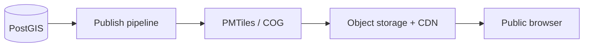
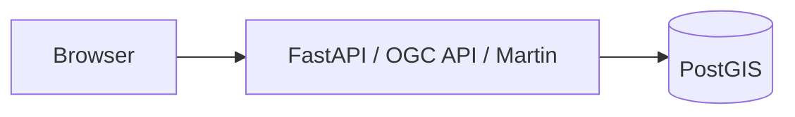

# Deployment architecture

## Environments

- `development`
- `staging`
- `production`

## Public read path

For stable public layers, prefer immutable release artifacts on object storage/CDN:



This reduces public dependency on live database availability and supports high traffic.

## Live professional path



## Deployment units

Recommended initial container/service set:

```text
web
kristal-farms-api
pygeoapi
martin
postgres-postgis
```

Add queue/workers only when long-running jobs justify them.

## Infrastructure portability

Use standard containers, object storage, PostgreSQL, OIDC, and CDN primitives. Cloud-specific managed services are allowed, but the application should not require a proprietary geospatial backend.
