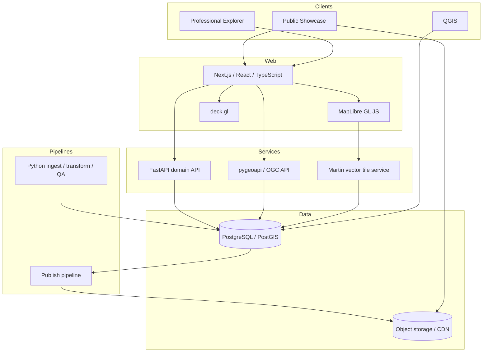

# Architecture overview

## Target architecture



## Responsibility boundaries

| Component | Primary responsibility |
|---|---|
| React/Next.js | Product UI, route composition, narrative surfaces |
| MapLibre | Base map, vector/raster cartography, terrain/globe |
| deck.gl | High-volume or specialized GPU visualization |
| FastAPI | Domain logic, scenarios, search/composite operations |
| pygeoapi | Standards-based feature access |
| Martin | High-performance vector tile delivery |
| PostGIS | Canonical operational geospatial data and relations |
| QGIS | Professional desktop GIS editing/analysis |
| PMTiles/COG | Immutable public release artifacts |

## Architectural style

The system is **modular, data-driven, and standards-aware**, but not microservice-heavy by default. Services are separated where responsibilities are materially different. They may initially deploy together.

## Evolution strategy

The MVP may begin with PostGIS + Web + static PMTiles. Martin, pygeoapi, and dedicated scenario services can be activated incrementally without changing the data model.

## Monorepo system boundaries

The deployment architecture above is complemented by a repository dependency boundary:

```text
Knowledge / research
    research/
       ↓ explicit promotion
Data platform / contract
    pipelines/ + database/ + contracts/ + packages/ + data/
       ↓ publish views / immutable releases / APIs / tiles
Product
    apps/ + services/
```

Product runtime code must not import or execute research or pipeline code. See [Workspace boundaries](workspace-boundaries.md).
