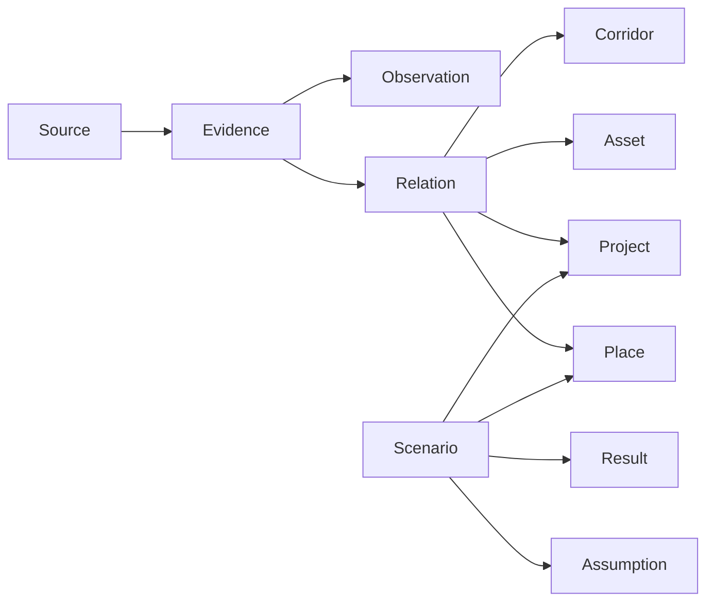

# Data model

## Design goals

- preserve evidence and provenance;
- support GIS workflows;
- distinguish observed truth from hypotheses;
- support time-aware data;
- enable data-driven frontend behavior;
- allow public and restricted representations;
- keep durable identifiers across formats.

## Entity groups



## Core tables

### `core.place`

```text
id                  stable text/UUID identifier
name                display name
place_type          community, port, region, study_area, site, ...
geometry            nullable geometry
jurisdiction        optional jurisdiction
status              lifecycle/status
metadata            JSONB extension fields
created_at
updated_at
```

### `core.asset`

```text
id
name
asset_type
technology
geometry
operator
operational_status
commissioned_date
capacity_value
capacity_unit
metadata
```

### `core.project`

```text
id
name
project_type
role                external_reference | kristal_candidate | kristal_project
status
geometry
developer
operator
technology
capacity_mw
metadata
```

### `core.corridor`

```text
id
name
corridor_type        road | marine | transmission | distribution | fibre | conceptual
status
geometry
operator
metadata
```

## Research tables

See [Evidence model](evidence-model.md).

## Scenario tables

See [Scenario model](../scenarios/scenario-model.md).

## IDs

IDs are immutable references. Names may change; IDs should not.

Recommended human-readable prefixes are acceptable for imported research records, e.g. `REF-INNAVIK`, but long-term canonical IDs should have a documented namespace strategy and uniqueness checks.

## Extension fields

Use typed columns for frequently queried or semantically important fields. Use `metadata JSONB` for sparse source-specific extensions. Do not put core semantics only in JSONB if the application needs to filter, validate, index, or govern them.
