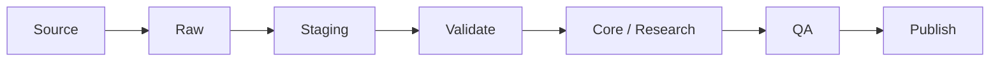

# Data ingestion

## Flow



## `raw`

Preserve source-faithful values and source metadata. Avoid irreversible cleaning.

## `staging`

Perform parsing, CRS conversion, unit normalization, entity matching, and schema mapping.

## `core` / `research`

Write only records that satisfy canonical constraints.

## Idempotency

Imports should be rerunnable. Use stable source IDs, checksums, or import batch IDs to avoid uncontrolled duplication.

## Import manifest

Each import should record at least:

```text
import_id
source_id
source_hash
started_at
completed_at
record_count
warning_count
error_count
code_version
```

## Manual review

Ambiguous entity matches, regulatory interpretation, or source conflicts should enter a review queue/state rather than being guessed by automation.
