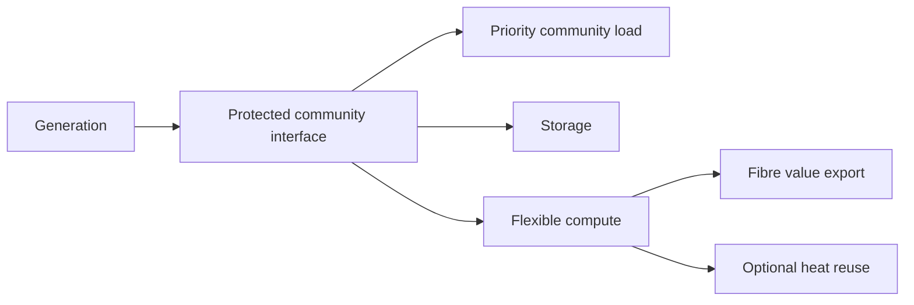

# Scenario model

## Definition

A scenario is an explicit hypothetical system configuration evaluated against a known dataset/model version.

## Core record

```text
id
name
description
owner/status
geometry or linked place/site
base_data_version
model_version
created_at
updated_at
metadata
```

## Assumptions

Each material assumption should carry:

```text
parameter
value
unit
source_type
source/evidence reference when applicable
notes
```

Source types:

```text
user_input
engineering_assumption
derived
evidence
default
```

## Initial system topology



## Siting variants

```text
generation_side
community_side
split
```

No variant is globally preferred by the model.
